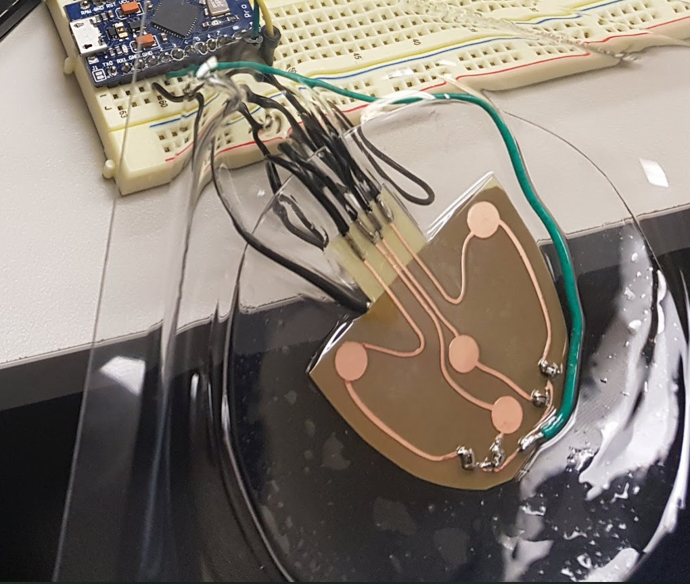
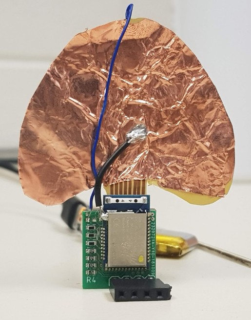
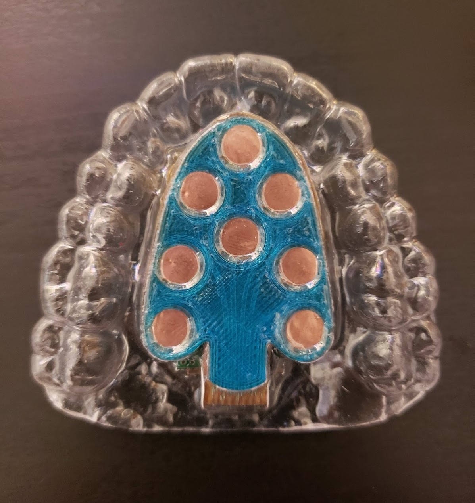

# Speech Decoding Retainer

This repository contains code for the speech decoding retainer projects I undertook during my last year at college. This includes everything from the Bluetooth controlled wheelchair to the retainer itself and all programming utilities that went into it. 

For more information on the retainer construction and development, the paper is in the root of the repository. 

